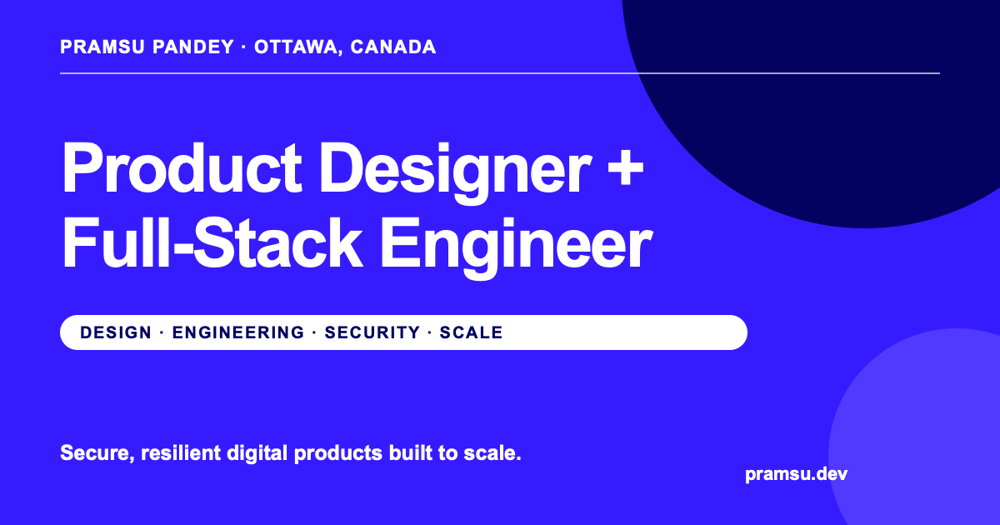

# my portfolio!!

hello! this is my personal portfolio, i'm Pramsu and i'm a product designer + full-stack engineer from Ottawa. i made this site to show who i am, what i do, and (eventually) all the cool stuff i've worked on.

you can see it here: **[pramsu.dev](https://pramsu.dev)**



## why i built this

i obviously needed a portfolio, but i REALLY did not want one of those super boring sites that's just a picture, some text, and 3 cards under it. i wanted the site itself to feel like one of my projects and actually show both the design and engineering stuff i like doing.

so i ended up making this very motion-heavy site with giant typography, ascii art, weird transitions, my signature everywhere, and a scroll animation that took WAY longer to get right than i expected. the main idea is that i take messy ideas and turn them into real, polished products that actually work.

the project cards are placeholders rn because i'm still getting the full case studies ready (coming soon trust).

## cool stuff it does

- the first few pages all transition into each other while you scroll
- the little expertise banner speeds up depending on how you scroll
- it has a custom cursor because the normal cursor was apparently not enough for me
- the whole thing works on phones too, including a separate mobile menu
- animations turn off if you have reduced motion enabled
- it has proper sharing images, search metadata, a sitemap, and all that fun SEO stuff
- basically all the text and project info is kept in one file so i don't have to search through 900 components later

## what i used

- [Astro](https://astro.build/) for the actual site
- TypeScript for the interactive stuff
- [GSAP](https://gsap.com/) for the VERY many scroll animations
- regular CSS for everything else (no giant UI library!!!)

## running it yourself

you need Node.js 22.12 or newer and npm. then just do this:

```bash
git clone https://github.com/pjontop/pjportoflioontop.git
cd pjportoflioontop
npm install
npm run astro -- dev --background
```

then open `http://localhost:4321` and it should hopefully be alive.

the dev server runs in the background, so these are the useful commands:

```bash
npm run astro -- dev status
npm run astro -- dev logs
npm run astro -- dev stop
```

there are no environment variables or accounts you need to set up, which is nice.

## other commands

```bash
npm run check    # checks for Astro/TypeScript problems
npm run build    # makes the final production site
npm run preview  # previews the production build
```

## where everything is

- `src/components` has all the different sections and UI pieces
- `src/data/site.ts` has my info, links, and project cards
- `src/pages/index.astro` puts the homepage together
- `src/scripts` has the scrolling, cursor, navbar, and mobile menu logic
- `src/styles` has the global and page CSS
- `src/shaders` has the ascii-style SVG art
- `public` has the fonts, icons, signatures, and preview image

the big scroll sequence is mostly controlled by `src/scripts/scrollExperience.ts`. it moves from the intro, to the process page, to the showreel, and then finally lets you continue down to the projects and contact section. yes it is as annoying to debug as it sounds.

## before uploading changes

i usually run these so i don't deploy something completely broken:

```bash
npm run check
npm run build
```

## credits

designed and built by me, [Pramsu Pandey](https://github.com/pjontop), using Astro and GSAP. HUGE thanks to the people who made those because i do not want to imagine writing these animations completely from scratch.
